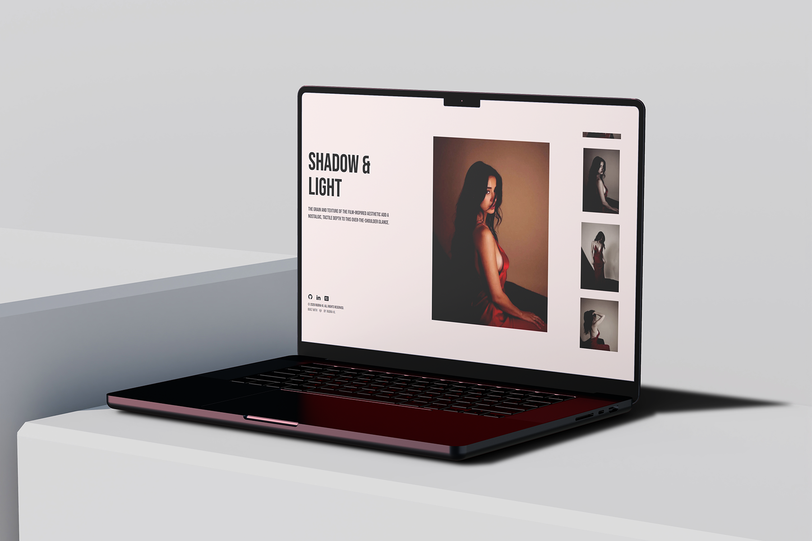

# ✨ Silk Slip - Disha Patani in Crimson Light ✨

Silk Slip is an intimate, scroll‑driven gallery that captures **Disha Patani** in eleven bold, crimson‑lit editorial frames. The experience is built to feel like a visual storybook—each frame flows into the next, creating a seamless, immersive journey through curated imagery.

---



**Live Demo:** [Silk Slip](https://silk-slip.vercel.app/)

---

## Concept 🎭

Silk Slip is an intimate, scroll‑driven gallery that captures `Disha Patani` in eleven bold, crimson‑lit editorial frames. The experience is built to feel like a visual storybook—each frame flows into the next, creating a seamless, immersive journey through curated imagery. It reads like a photographic narrative: slow, deliberate, and cinematic.

---

## Layout & interaction 🗺️

- The UI is organized into three vertical sections:
    - Left column — contextual text and captions: concise editorial copy, credits, and optional navigation hints.
    - Center column — the main Preview: the focal image/frame, displayed large and centered. This is the visual heart of the experience.
    - Right column — a smooth, scrollable sidebar: a tactile strip of thumbnails or frame snippets the user scrolls through; selecting or scrolling the sidebar updates the main preview and the left text in real time.
- The gallery is scroll-driven: as users scroll the right sidebar (or the page), the main preview crossfades or animates into the next frame and the left column text transitions to match—creating an uninterrupted storytelling flow.
- Users can change the main preview image and associated text by:
    - Scrolling the right sidebar (continuous selection).
    - Clicking/tapping a thumbnail in the sidebar.
    - Keyboard navigation or accessible controls for next/previous frames.

### Implementation notes

- Pages and layout live under `src/app/` (e.g. `src/app/page.tsx` and `src/app/layout.tsx`).
- Interactive pieces are built as components under `src/components/` (e.g. a `Sidebar` and `Preview` component).
- Smooth scrolling hook: `src/hooks/useLenis` — integrates Lenis for refined scroll behavior.
- Reveal/animation utilities: `src/hooks/useReveal` and third‑party GSAP config under `src/lib/`.
- Image assets: `public/images/` — the eleven editorial frames (`disha-1` → `disha-11`) power the preview and thumbnails.

---

## Tech Stack 🛠️

- **Framework**: Next.js 14+ (App Router)
- **Next.js**: App Router with `app/` directory, server components, and layout-based routing.
- **Styling**: Tailwind CSS
- **Animations**: GSAP (GreenSock Animation Platform)
- **Smooth Scrolling**: Lenis
- **Icons**: Remix Icon
- **Type Checking**: TypeScript
- **Package Manager**: npm / Bun

---

## Features 🌟

- **Elegant UI/UX**: A clean, modern, and intuitive interface designed for aesthetic.
- **Smooth Animations**: Powered by GSAP for engaging and fluid transitions.
- **Smooth Scrolling**: Implemented with Lenis for a refined and satisfying experience.

---

## Getting Started ✨

First, install the dependencies:

```bash
npm install
# or
bun install
```

Then, run the development server:

```bash
npm run dev
# or
bun run dev
```

Open [http://localhost:3000](http://localhost:3000) with your browser to see the result. The page will automatically reload when you make changes to the code. You can also view any build errors or lint warnings in the console.

### Available Scripts

- `npm run dev` / `bun run dev` – Start the development server.
- `npm run build` / `bun run build` – Create an optimized production build.
- `npm run start` / `bun run start` – Run the production server.
- `npm run lint` / `bun run lint` – Lint the project with Biome.
- `npm run format` / `bun run format` – Format code (Biome / Prettier).

---

## Project Structure 🗂️

```plaintext
silk-slip/
├── public/                # Static assets & branding
│   ├── images/            # Showcase photography (disha-1 to 11)
│   └── og-image.jpg       # Social media preview
├── src/
│   ├── app/               # Next.js App Router (Server Components)
│   │   ├── layout.tsx     # Root layout
│   │   └── page.tsx       # Main landing page
│   ├── components/        # Interactive UI (Sidebar, Previews)
│   ├── hooks/             # Custom logic (useLenis, useReveal)
│   ├── lib/               # Third-party configs (GSAP)
│   └── constants/         # App-wide static data
├── biome.json             # Linting & Formatting
├── bun.lock               # Bun lockfile
└── next.config.ts         # Project configuration
```

---

## Code Quality 🦾

- Run `npm run lint` / `bun run lint` to check code style.
- Run `npm run format` / `bun run format` to automatically format your code.

[Biome](https://biomejs.dev) helps keep the project consistent and easy to maintain across different editors.

---

## Roadmap 🗺️

- **Improved Accessibility:** Enhancing accessibility features to meet WCAG standards.
- **Responsive Layouts:** Improving responsiveness across all devices, ensuring an optimal experience on mobile, tablet, and desktop.

---

## Deploy on Vercel 🚀

**Silk Slip** is deployed on [Vercel](https://vercel.com/new?utm_medium=default-template&filter=next.js&utm_source=create-next-app&utm_campaign=create-next-app-readme) the recommended platform for Next.js apps.
See the Next.js deployment [Next.js deployment documentation](https://nextjs.org/docs/app/building-your-application/deploying) docs for details.

---

## Author 🧑‍🦱

[](https://github.com/rudra-xi)

### Contact

[](https://www.instagram.com/rudra.xii/)
[](https://www.linkedin.com/in/goutam-rudraxi)

---

## License 🪪

This project is licensed under the MIT License. See the [](./LICENSE.md) file for more information.
